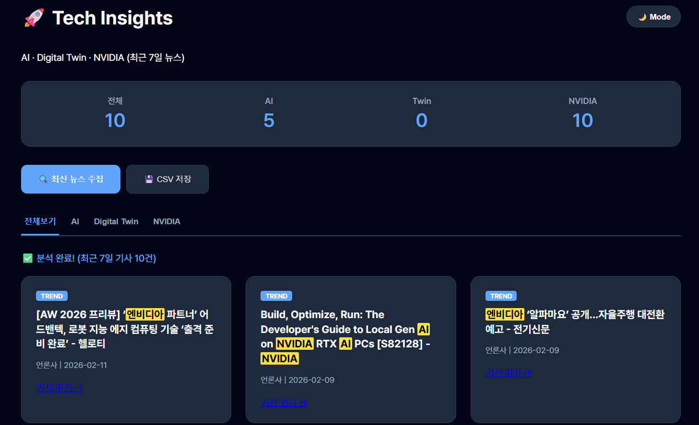

# 🚀 AI & Digital Twin 실시간 뉴스 대시보드

이 프로젝트는 **Google News RSS**를 활용하여 AI, Digital Twin, 그리고 NVIDIA 관련 최신 기술 동향을 수집하고 분석하는 웹 대시보드입니다. 별도의 API 키 없이도 즉시 실행 가능하며, 최근 7일간의 기사를 카테고리별로 제공합니다.

## ✨ 주요 기능

* **실시간 뉴스 수집**: 최근 7일 이내의 'AI', 'Digital Twin', 'NVIDIA' 관련 뉴스를 병렬 검색으로 빠르게 수집합니다.
* **데이터 분석 통계**: 수집된 전체 기사 중 각 키워드가 차지하는 비중을 상단 대시보드에서 한눈에 파악할 수 있습니다.
* **카테고리 탭 분류**: 탭을 클릭하여 특정 주제(AI/Twin/NVIDIA)의 기사만 필터링하여 볼 수 있습니다.
* **키워드 하이라이팅**: 제목 내 핵심 키워드를 시각적으로 강조하여 가독성을 높였습니다.
* **다크 모드 지원**: 사용자 환경에 맞는 라이트/다크 테마를 제공합니다.
* **CSV 데이터 내보내기**: 수집된 기사 리스트를 엑셀에서 활용 가능한 CSV 파일로 저장할 수 있습니다.

## 🚀 바로 실행하기 (StackBlitz)

별도의 설치 없이 브라우저에서 바로 실행해볼 수 있습니다.

👉 **[https://stackblitz.com/~/github.com/Bae-Sunny/ai-digital-twin-dashboard]**

---

## 🛠 사용 방법

1. **뉴스 수집**: 메인 화면의 `🔍 최신 뉴스 수집` 버튼을 클릭합니다.
2. **분류 보기**: 상단 탭(`전체`, `AI`, `Digital Twin`, `NVIDIA`)을 눌러 원하는 주제의 기사를 필터링합니다.
3. **다크 모드**: 우측 상단의 `🌙 Mode` 버튼으로 테마를 전환합니다.
4. **저장**: `💾 CSV 저장` 버튼을 눌러 수집된 데이터를 다운로드합니다.


## 🗂 기술 스택

* **Frontend**: HTML5, CSS3 (Modern UI/UX), JavaScript (ES6+)
* **API**: Google News RSS (via rss2json)
* **Environment**: StackBlitz (WebContainer)

## 💡 개발 가이드 (로컬 실행)

```bash
# 1. 저장소 클론
git clone https://github.com/Bae-Sunny/ai-digital-twin-dashboard

# 2. 폴더 이동
cd ai-digital-twin-dashboard

# 3. index.html 파일을 브라우저로 열기

```

---

## 📄 라이선스

이 프로젝트는 MIT 라이선스 하에 배포됩니다.

---